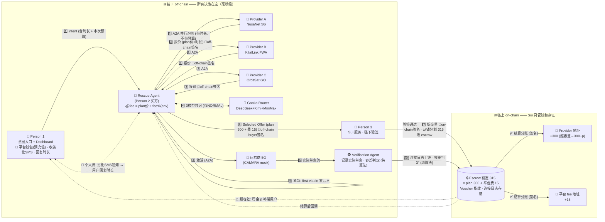

# Autonomous Connectivity Resilience Exchange — Hackathon Blueprint

**Hackathon MVP Blueprint, Architecture & 3-Person Work Plan**

**Speed-first • Reliability-first • A2A + Gonka + Sui**

> **Hackathon goal:** Prove that the product can detect a connectivity shortfall, protect critical traffic, autonomously select a viable recovery provider, activate a pre-connected backup path, and complete a trusted Sui-backed service agreement — with measurable recovery time and fallback behavior.

**Core flow: Detect → Protect → Find → Activate → Verify → Settle**

---

## 1. Product Definition

The product is a connectivity resilience layer that sits above an organisation's existing WAN, Wi-Fi/LAN and provider contracts. It is not a replacement for ordinary failover or Wi-Fi management.

> **Where our value starts:** Traditional failover has already happened — but the remaining network is unavailable, degraded, or insufficient for current demand. The system then acquires and activates additional capacity from pre-connected and pre-onboarded providers.

### 1.1 Target Customers

| Segment | Customer | MVP Offer | Priority Logic |
| --- | --- | --- | --- |
| Individual | Normal user | Basic recovery queue; standard provider search; lower burst ceiling | Commercial priority P3 |
| Individual | VIP | Faster queue; wider provider search; higher spending/burst ceiling | Commercial priority P2 |
| Individual | VVIP | Highest commercial queue; fastest eligible provider; highest configured ceiling | Commercial priority P1 |
| Business | SME / MNC | API/SDK integration; critical-service policies; multi-provider recovery | Business policy + service criticality |
| Event / Venue | Stadium / Expo / Concert | Venue gateway integration; traffic protection; surge/failure recovery | P0 emergency override + event policy |
| Public / Disaster | Emergency command / disaster response | Pre-authorised emergency recovery and multi-path connectivity | P0 safety override |

> **Important priority rule:** Paid plans never outrank life-safety or emergency traffic. A P0 emergency override sits above VVIP/VIP/Normal. Commercial plans only affect non-emergency queueing, search breadth, spending limits and service treatment.

### 1.2 Revenue Model (Decided)

| Side | Charging Model | Notes |
| --- | --- | --- |
| Individual (Normal / VIP / VVIP) | Pay-as-you-go — transaction fee per completed recovery | Charged only when a recovery actually happens. |
| Business (SME / MNC / Venue) | Setup fee + pay-as-you-go transaction fee | One-time setup/onboarding fee, then the same per-transaction fee. |
| Provider (A / B / C agents) | Joining fee (加盟费) only | Providers pay to be onboarded on the exchange; no per-transaction cut from providers — they receive their full quoted plan price. |

> Decision (final, no further payment-gateway research needed): joining fee from providers; pay-as-you-go transaction fee from individuals; setup fee + pay-as-you-go from business customers.

### 1.3 Transaction Fee & Escrow Split Rules

- **Fee base is the plan price, never the wallet balance.** A user holding 1,000 who buys a 300 plan pays the fee on 300, not on 1,000.
- **Fee is added on top of the plan price and shown openly.** Example: plan 300 + fee% (env-configurable, e.g. `PLATFORM_FEE_PERCENT=5`) → customer charged 315, and can see that 15 is the platform fee. Nothing is skimmed silently from either side — the blockchain makes hiding it impossible anyway.
- **Disclosed once at onboarding/login** (policy screen); after that, every offer simply shows plan price + fee.
- **Escrow split settlement:** the escrowed amount is released to two addresses — the provider's quoted amount to the provider address, the platform fee to the platform address (315 → 300 provider + 15 platform), split by signature at settlement. 资金流向图与详解见 3.3。

---

## 2. Client Interfaces

The MVP should expose two customer-facing entry paths while sharing the same recovery core.

| Interface | Who Uses It | MVP Functions |
| --- | --- | --- |
| Individual Web/Mobile UI | Normal / VIP / VVIP | Choose plan; receive degradation alert (SMS) and reply with a desired duration; top up platform wallet; submit recovery intent; view queue/status, selected provider and recovery timer. Actual network switching requires a participating carrier/API or a pre-provisioned multi-SIM/eSIM/multi-access path. |
| Enterprise Dashboard | SME / MNC / venue operator | Configure services, priorities, budgets, providers, readiness and incident status |
| REST API / Webhook | Enterprise systems | Send service events; submit connectivity intent; receive recovery callbacks |
| Lightweight SDK / Sample Connector | Hackathon proof | Demonstrate how POS/broadcast/security systems can connect without each becoming an AI agent |

### 2.1 Example Enterprise Intent

> Example `POST /recovery/intents` → `service="broadcast"`, `severity="high"`, `min_capacity_mbps=200`, `max_latency_ms=80`, `duration_min=30`, `max_budget=100`. The client describes the outcome it needs; it does not choose the provider itself.

> **Individual-user feasibility note:** For the hackathon, the Individual Normal/VIP/VVIP flow proves priority, provider selection and settlement. A real consumer deployment cannot make any phone jump to any carrier by software alone; it requires operator participation (for example CAMARA/network APIs) or a pre-provisioned multi-SIM/eSIM/multi-access connectivity path. The MVP should simulate this access cleanly rather than claim arbitrary carrier switching.

---

## 3. MVP Architecture Blueprint

### 3.1 Component Responsibilities

| Component | Responsibility | MVP Implementation |
| --- | --- | --- |
| Service Gateway | Receive client events/intents | REST API + webhook + sample enterprise connector |
| Network Watcher | Detect link failure, degradation, capacity shortfall and SLA breach | Simulated metrics + real local probes where possible |
| Priority Controller | Apply P0 safety override, enterprise policy and Normal/VIP/VVIP queue rules | Deterministic rule engine |
| Network Rescue Agent | Core reasoning and orchestration; platform fee calculation on the plan price | Gonka + A2A; parallel provider query and selection; buyer budget never leaves the buyer side |
| Network Provider Agents | Represent providers and expose availability/price/capability | 2–3 independently deployed agents with different policies |
| Activation Adapter | Make the selected network action happen | CAMARA QoD sandbox/mock plus generic provider adapter |
| Traffic Controller | Reroute/throttle traffic after recovery selection | SD-WAN/gateway simulation or local routing demo |
| Verification Agent | Record actual delivered capacity for the whole recovered session; on-chain connection log; algorithmic tolerance check and penalty deduction feeding settlement | Off-chain session monitor + deterministic tolerance check; log hash/details written to Sui |
| Sui Trust Layer | Authority, escrow, signed voucher, split settlement and proof storage | Move contracts + testnet transactions |
| Telemetry Dashboard | Measure speed and reliability | Live incident timeline, provider state, recovery result |

### 3.2 Where Each Technology Fits

| Technology | Why We Use It |
| --- | --- |
| Gonka | Choose the best recovery action using availability, activation time, reliability, capacity and cost. |
| A2A | Provider discovery/communication and structured requests/offers between independently deployed agents. |
| Sui | Prepare trust before incidents: authority, pre-funded escrow, signed commitment and auditable settlement. |
| CAMARA QoD | When recovery uses 4G/5G, request network-managed stable latency or prioritised throughput for selected app flows. |
| SD-WAN / Gateway Adapter | Actually move real traffic to the chosen path; the AI does not route packets by itself. |

### 3.3 System Diagram — off-chain decisions, on-chain money & proof

> 在原版架构图上加入了本轮新需求：**时长 + 预算隐私**（步骤 1/2/3）、**平台费与双地址分账**（步骤 6/7 与右侧结算分账）、**Verification Agent 验证与扣罚**（步骤 9/10）、**个人 SMS 动态购买流**（虚线）、**Escrow 资金流**（锁 315 → 判定 → 双地址分账/扣罚）。图下附 Escrow 资金流详解。

**Escrow 资金流详解（例子：plan 300 + 5% fee = 315，钱包预充值 1000）：**

1. **锁钱 (lock)** — Selected Offer 双签名后，Person 3 验签并提交 Sui 交易：315 从用户平台钱包划入 escrow 对象，同时把 voucher 指纹（off-chain 双签名报价的 hash）和两个收款地址一并写上链。此后谁也动不了这笔钱——用户拿不回、provider 拿不到、平台也拿不到；钱包剩 685 可继续用。
2. **冻结期 (frozen)** — 服务进行中，escrow 只是链上的承诺。Provider 敢先开通，是因为锁着的钱跑不掉；用户敢先激活，是因为不达标有扣罚保障——双方信任都来自这笔锁钱。
3. **判定 (verdict)** — 时长结束，Verification Agent 把连接日志（实测带宽）上链，纯算法对比承诺值与容差范围，得出 verdict。
4. **分账 (split settlement)** —
   - ✅ 达标：一笔结算交易按 voucher 里的双地址分账——300 → provider 地址，15 → 平台 fee 地址。
   - ⚠️ 超容差：provider 只得 300−p，罚金 p 补偿回用户，平台 15 照拿；链上连接日志就是扣罚证据。
5. **回调 (callback)** — settlement 完成后回调 Rescue Agent，订单关账。

> 流程定义见 4.3（验证与扣罚）、4.4（个人 SMS 动态购买流）。

---

## 4. End-to-End Runtime Flow

### 4.1 Before the Incident — Readiness Phase

- Primary and backup paths are physically reachable or emulated.
- Provider agents are onboarded and cached.
- API/OAuth credentials are valid and proactively refreshed.
- Normal/VIP/VVIP and enterprise emergency policies are configured.
- Sui emergency escrow is funded and the Rescue Agent has scoped spending authority.
- Provider health and capability are checked continuously.

### 4.2 During the Incident — Fast Path

1. Network Watcher detects failure/degradation/shortfall or receives an authorised urgent event.
2. Priority Controller applies P0 safety rules first, then enterprise/plan priority.
3. Traffic Controller immediately protects critical traffic by throttling/deprioritising low-priority traffic.
4. Network Rescue Agent queries all ready providers in parallel using structured A2A requests (requests carry the required duration; the buyer's budget is never revealed to provider agents).
5. Gonka selects the first/best viable offer based on emergency mode or normal mode.
6. Buyer and provider sign a short-lived recovery voucher tied to pre-funded Sui authority; the escrow amount = plan price + platform transaction fee.
7. Provider activates the path through CAMARA/provider API while the Sui commitment is submitted in parallel.
8. Traffic Controller moves selected traffic to the recovered path.
9. Network Watcher verifies the KPI. If the path fails validation, the next provider is activated.
10. After service, verification and split settlement complete the loop (see 4.3); traffic fails back only when the primary path is stable.

### 4.3 After Service — Verification & Split Settlement

1. For the whole recovered session, the Verification Agent records the actually delivered capacity/quality (start, end, sampled bandwidth) as a connection log.
2. When the purchased duration ends, a deterministic (non-LLM) check compares delivered vs promised against a configurable tolerance range.
3. Within tolerance → settlement releases the escrow to two addresses: provider amount → provider address, platform fee → platform address.
4. Below promise beyond tolerance → a proportional penalty is deducted from the provider payout (never a full refund); the on-chain connection log is the evidence, so the customer can see exactly what was delivered at any moment.

> Escrow 资金流（锁钱 → 冻结 → 判定 → 双地址分账/扣罚）已整合进 3.3 的系统图，并附详解。

> This verification loop is the answer to "why not buy directly from the provider": the marketplace is the only channel where delivery is measured, logged on-chain and enforced with a penalty.

### 4.4 Individual Dynamic Purchase Flow (SMS-triggered)

1. The watcher/portal detects the user's line degrading.
2. The system pushes an **SMS notification** (deliberately not WhatsApp — WhatsApp itself depends on the WiFi/data that just failed).
3. The user replies with a duration (e.g. "5 minutes"); no pre-configuration required.
4. The Rescue Agent asks providers for duration-based plans without revealing the wallet balance, selects the best offer, deducts plan price + fee from the user's pre-loaded platform wallet, and **activates immediately**.
5. Per purchase, the user decides how much of the wallet to allocate to that offer; the allocated amount — not the wallet total — is all the provider side ever sees.

---

## 5. Hackathon Scenarios to Demonstrate

The MVP does not need to physically reproduce every scenario. Build one primary live scenario and use controlled simulations for the others.

| Scenario | Trigger | Recommended System Response | Why It Matters |
| --- | --- | --- | --- |
| S1 — Backup Capacity Insufficient **(PRIMARY DEMO)** | Primary link fails; backup works but cannot serve current critical demand. | Protect P0/P1 traffic → query providers → activate extra 5G/FWA/satellite-like capacity → reroute → settle. | Best overall proof because traditional failover succeeds but is still not enough. |
| S2 — Provider Degradation | Primary path is still up but latency/packet loss violates service requirements. | Early warning → compare alternative path → move critical traffic before full failure. | Shows proactive reliability instead of only reacting to cable cuts. |
| S3 — Sudden Demand Surge | No line fails; event demand exceeds planned backhaul capacity. | Apply priority queue + throttle guest traffic + activate temporary burst capacity. | Connects directly to Stadium/concert use case. |
| S4 — Physical Link Failure | Fibre is cut or provider becomes unreachable. | Existing failover first; if backup is insufficient, autonomous capacity acquisition starts. | Easy to understand, but do not claim we repair physical infrastructure. |
| S5 — Disaster / Emergency | Multiple paths are degraded while medical/rescue traffic suddenly grows. | P0 override → pre-authorised fast path → combine remaining provider capacity → protect emergency services. | Strong social-impact extension; paid VVIP never overrides P0. |
| S6 — Individual Priority Queue | Many individual recovery requests compete for limited temporary capacity. | P0 override first; then VVIP → VIP → Normal subject to availability, fairness and plan ceilings. | Proves B2C package logic without mixing it with life-safety policy. |

### 5.1 Primary Live Demo Recommendation

> **Demo S1: Backup Is Not Enough**
> Start with Primary = 1,000 Mbps and Backup = 500 Mbps. Simulate a primary failure while critical demand is 700 Mbps. The system should protect critical traffic, discover a 300 Mbps provider offer, sign/activate it, rebalance traffic to 800 Mbps total and display the measured Time-to-Recovery.

---

## 6. Speed & Reliability Feature Blueprint

Instead of treating every optimization as a separate feature, the MVP should organise them into six engineering categories.

| Category | What We Build | Why It Improves Speed / Reliability |
| --- | --- | --- |
| A. Provider Readiness | Pre-onboard providers; cache Agent Cards/capabilities; maintain credentials; refresh tokens; health checks; standby terms. | Removes discovery, login, onboarding and commercial setup from the urgent path. |
| B. Early Detection | Link probes; latency/packet-loss/capacity thresholds; service-health events; warning → prepare → activate states. | Starts recovery before complete failure when possible. |
| C. Fast Decision | Parallel A2A requests; structured offer schema; emergency decision mode; first-viable selection; strict timeout/fail-fast. | Avoids long LLM conversations and sequential provider waits. |
| D. Fast Activation | Pre-connected backup paths; warm API sessions where practical; traffic-controller adapter; idempotent activation request. | Shortens provider selection → real packet recovery. |
| E. Non-Blocking Trust | Pre-funded Sui escrow; scoped authority; off-chain co-signed recovery voucher; Sui submission/settlement in parallel. | Provider can act immediately without waiting for a new manual payment flow. |
| F. Reliability Guardrails | Provider health score; fallback order; retry to next provider; local deterministic fallback; result verification; safe failback. | The system remains useful if Gonka/cloud/provider A is unavailable. |

### 6.1 Measurable MVP KPIs

| KPI | How to Measure in Demo | Success Definition |
| --- | --- | --- |
| Time-to-Detect | Incident timestamp → Watcher event | Measured, not assumed |
| Time-to-Decision | Watcher event → provider selected | Compare parallel vs sequential path |
| Time-to-Activation | Provider selected → activation acknowledgement | Show provider-specific value |
| End-to-End Time-to-Recovery | Incident → critical service restored | Primary headline metric |
| Recovery Success Rate | Successful recoveries / test runs | Run repeated scripted tests |
| Failover Success | Provider A unavailable → provider B successfully used | Must work without manual intervention |
| Duplicate-Safety | Repeated request does not create duplicate service/payment | Use incident ID + idempotency key + nonce |

> **Do not make an unsupported speed guarantee:** The hackathon should claim automation and measured prototype latency, not promise a universal fixed recovery time. External provider APIs and real network provisioning remain outside full control.

---

## 7. MVP Scope — What We Must Build

### 7.1 Must-Have

- Individual portal with Normal / VIP / VVIP plan selection and queue simulation.
- Enterprise dashboard/API for service intents, priority policies, provider readiness and incident state.
- Service Gateway with at least one sample enterprise connector.
- Network Watcher with scripted failure/degradation/capacity-shortfall generator.
- Priority Controller with P0 override + commercial plans + enterprise rules.
- One Network Rescue Agent using Gonka.
- At least two independently deployed Network Provider Agents; three preferred.
- Structured A2A request/offer flow with parallel provider calls.
- Provider activation adapter (CAMARA-like QoD path + generic mock path).
- Traffic Controller simulation showing which traffic moves/throttles.
- Sui testnet: authority object, escrow/funds, signed recovery commitment and final settlement.
- Live Time-to-Recovery dashboard and repeatable scenario scripts.
- Duration as a first-class field in intents, provider plans and offers.
- Platform wallet (pre-load) with per-offer budget allocation.
- Fee engine: env-configurable transaction fee % on the plan price, shown transparently (see 1.3).
- Sui escrow split settlement to two addresses (provider amount + platform fee).
- Verification Agent: on-chain connection log, tolerance range and penalty deduction.
- SMS-triggered individual purchase flow (simulated in the MVP).

### 7.2 Nice-to-Have

- Real CAMARA sandbox call if accessible during the hackathon.
- Third-party A2A agent for a supporting capability.
- Connectivity early-warning subscription.
- Provider reputation from completed recoveries.
- Predictive pre-arm mode before a likely surge.
- Programmable tunnel/state-channel style optimisation as a future design, not a blocker.

### 7.3 Explicitly Out of Scope

- Building or repairing physical fibre infrastructure.
- Replacing commercial SD-WAN products.
- Guaranteeing arbitrary instant fibre from a provider with no pre-connected path.
- Building production-grade telecom OSS/BSS integration.
- Serving tens of thousands of real stadium users.
- Letting paid VVIP users override medical/fire/public-safety priority.

---

## 8. Three-Person Task Distribution

The division below is designed so each member owns one independently demonstrable workstream, while all three converge at one end-to-end demo.

| Member | Primary Workstream | Owned Deliverables | Integration Contract |
| --- | --- | --- | --- |
| Person 1 — Client & Edge | Customer interfaces + detection + policy | Individual portal; Enterprise dashboard/API; Service Gateway; incident simulator; Network Watcher; Priority Controller; Normal/VIP/VVIP/P0 logic; traffic visualisation. | Outputs a standard Incident/Intent JSON to Person 2; consumes recovery status/events. |
| Person 2 — Agent & Provider Market | Gonka + A2A recovery orchestration | Network Rescue Agent; 2–3 Provider Agents; Agent Card/capability cache; parallel query; offer schema; normal vs emergency selection; provider health/fail-fast; provider activation adapter interface. | Consumes Incident/Intent from Person 1; returns signed selected offer to Person 3 and activation command/result to Person 1. |
| Person 3 — Sui & Reliability Execution | Trust/settlement + activation safety + measurement | Sui Move objects; scoped authority; pre-funded escrow; signed voucher verification; settlement; idempotency/nonce; recovery event ledger; fallback test harness; Time-to-Recovery instrumentation and final demo integration. | Consumes selected offer from Person 2; returns commitment/settlement status; publishes timing/reliability events to dashboard. |

### 8.1 Balanced Milestones

| Milestone | Person 1 | Person 2 | Person 3 |
| --- | --- | --- | --- |
| M1 — Contract First | Define Incident/Intent + UI wireframe | Define A2A Request/Offer + provider schemas | Define Sui Agreement/Voucher + event/timing schema |
| M2 — Independent Prototype | UI + Watcher + policy works with hardcoded provider result | A2A provider selection works from CLI/API | Sui escrow/authority/settlement works on testnet |
| M3 — First Integration | Emit real incident to Agent layer | Use incident to query providers and select | Receive selected offer and create commitment |
| M4 — Recovery Loop | Show traffic throttle/recovery state | Trigger provider activation adapter | Record timing + verify/settle/fallback |
| M5 — Demo Hardening | Scenario buttons + clean dashboard | Timeouts, parallelism, provider failure tests | Idempotency, retry, repeated-run reliability report |

### 8.2 Shared Responsibilities

- All three agree on API/event schemas before coding deeply.
- Every component must run as a separate service/process where A2A independence matters.
- Each person provides a one-command startup or container for their workstream.
- All three own one scripted failure test so no module becomes a black box.
- Final demo should be rehearsed with provider A failure and provider B fallback.

---

## 9. Minimal Integration Contracts

| Contract | Fields |
| --- | --- |
| **Incident / Intent** | `incident_id`, `customer_id`, `customer_type`, `plan`, `service`, `trigger_type`, `priority`, `required_capacity`, `max_latency`, `duration`, `max_budget`, `emergency_override` |
| **Provider Request** | `incident_id`, `requested_capacity`, `required_profile`, `duration`, `deadline`, `max_budget`, `pre_authorized=true` |
| **Provider Offer** | `provider_id`, `available`, `capacity`, `duration`, `expected_activation_class`, `price`, `reliability_score`, `offer_expiry`, `signature` |
| **Recovery Result** | `incident_id`, `selected_provider`, `activation_status`, `recovered_capacity`, `verification_status`, `t_detect`, `t_decide`, `t_activate`, `t_recover` |
| **Sui Voucher** | `incident_id`, `buyer`, `provider`, `amount`, `provider_amount`, `platform_fee`, `platform_address`, `authority_object`, `escrow_object`, `nonce`, `expiry`, `buyer_signature`, `provider_signature` |
| **Verification Record** | `incident_id`, `session_start`, `session_end`, `promised_capacity`, `delivered_samples`, `tolerance_range`, `verdict`, `penalty_amount`, `connection_log_hash` |

---

## 10. Final Hackathon Demo Script

1. Show Individual and Enterprise entry points. Individual has Normal/VIP/VVIP; Enterprise has configured critical services and providers.
2. Open Readiness panel: provider A/B/C healthy, credentials ready, Sui escrow funded, policies loaded.
3. Start Stadium S1 scenario: primary link fails and backup has only 500 Mbps while critical demand is 700 Mbps.
4. Watcher detects shortfall and Priority Controller throttles Guest/AR before any purchase.
5. Rescue Agent sends parallel A2A requests. Provider A fails/unavailable; Provider B offers 300 Mbps; Provider C is slower or expensive.
6. Gonka selects Provider B. UI shows why: available now, enough capacity, acceptable reliability and price.
7. Display signed recovery voucher and Sui authority/escrow state.
8. Activation adapter returns AVAILABLE; Traffic Controller shows critical services moved/protected.
9. Dashboard stops the Time-to-Recovery timer and verifies service KPIs.
10. Complete Sui settlement and show provider payment.
11. Run second test with Provider B forced down to prove automatic fallback to Provider C.

> **What the judges should remember:** This is not 'AI that picks Wi-Fi'. It is a speed-first resilience exchange: trust, credentials, policies and money are prepared before the incident, so during the incident the system only needs to detect, prioritise, select, activate and verify.

---

## 11. Key Risks & Recommended Hackathon Solutions

| Risk | Why It Matters | Hackathon Solution |
| --- | --- | --- |
| Real provider APIs unavailable | Could block the demo | Build provider adapter interface; use CAMARA-compatible mock first; real sandbox is bonus. |
| Physical path cannot appear instantly | Concept could sound magical | State clearly: instant recovery only uses pre-connected paths; marketplace buys capacity/entitlement, not cables. |
| Sui blocks emergency activation | Hurts speed story | Pre-fund escrow; co-sign voucher; activation and Sui commitment execute in parallel. |
| LLM response is slow/unpredictable | Bad for urgent path | Use deterministic P0 policy + structured offers + timeout; Gonka ranks viable options, local fallback remains available. |
| Paid plan appears unfair in disaster | Trust/reputation issue | P0 emergency override always outranks VVIP/VIP/Normal. |
| Provider A fails during demo | Could break end-to-end proof | Make provider failure an expected test; automatic provider B/C fallback is a reliability feature. |
| Duplicate activation/payment | Retries may create double actions | Use incident ID, idempotency key and nonce throughout activation and settlement. |

---

## 12. MVP Acceptance Criteria

| Proof | Pass Condition |
| --- | --- |
| Two customer types | Individual + Enterprise/Event can both submit/trigger a recovery intent. |
| Priority model | P0 override + Normal/VIP/VVIP commercial queue is visible and deterministic. |
| A2A independence | At least two provider agents run as separate services/endpoints. |
| Parallel selection | Provider requests are sent concurrently and one failure does not stall the system. |
| Real action abstraction | Selected provider triggers an activation adapter and traffic-state change. |
| Sui proof | At least one authority/escrow commitment and one final settlement transaction occur on testnet. |
| Speed proof | Live Time-to-Recovery is measured in the UI. |
| Reliability proof | Forced provider failure automatically falls back to another provider. |
| Repeatability | Primary scenario can be run multiple times without duplicate orders or payments. |
| Fee transparency | Customer sees plan price + fee; the fee is computed on the plan price, never on the wallet balance. |
| Split settlement | One settlement splits the escrow to the provider address and the platform fee address. |
| Verification proof | At least one on-chain connection log; an under-delivery beyond tolerance triggers a visible penalty deduction. |

---

## 13. Technical Notes for the Team

- **CAMARA Quality on Demand** provides a programmable API for requesting stable latency or prioritised throughput for specified application flows using provider-defined QoS profiles. It also defines session creation/status behavior and API onboarding/authentication expectations. For the hackathon, treat CAMARA as a network-capability adapter rather than as the marketplace itself.

- **Sui** is used as the trust and settlement layer, not the routing plane. The MVP should prepare authority and funds before an incident, then use a short-lived signed voucher so activation can proceed without a manual payment flow.

---

*MVP blueprint • 3-person work plan*