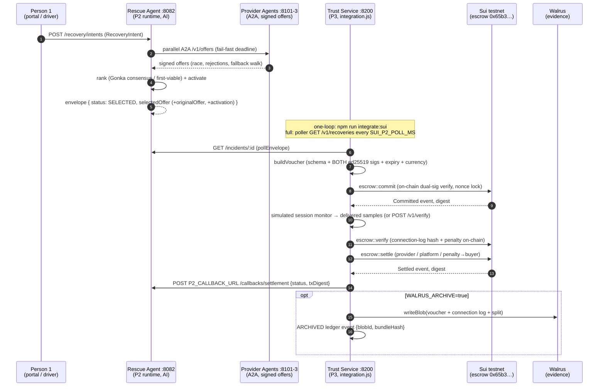
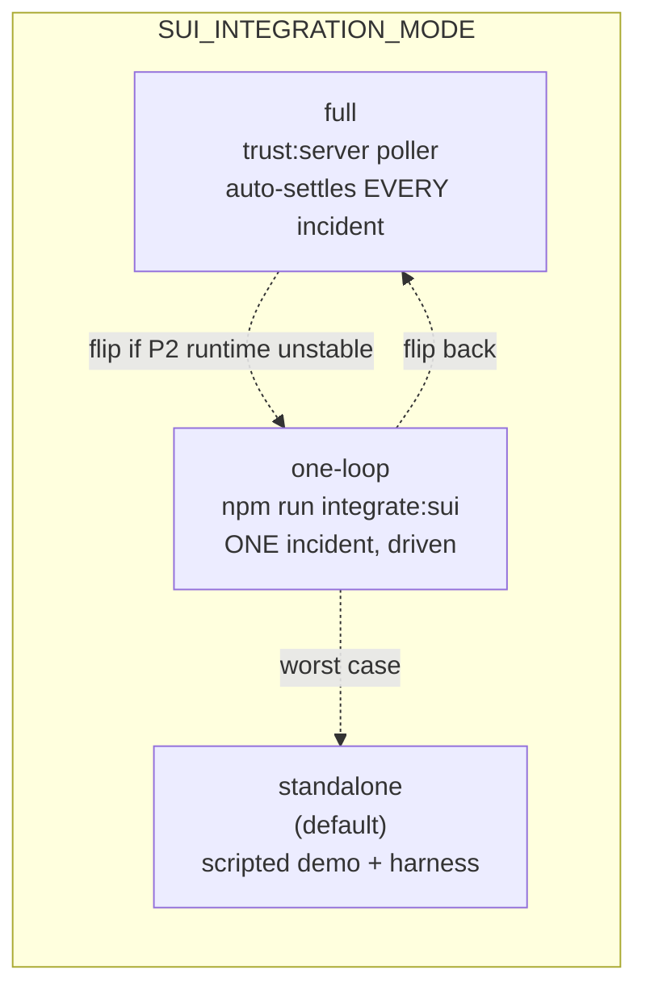
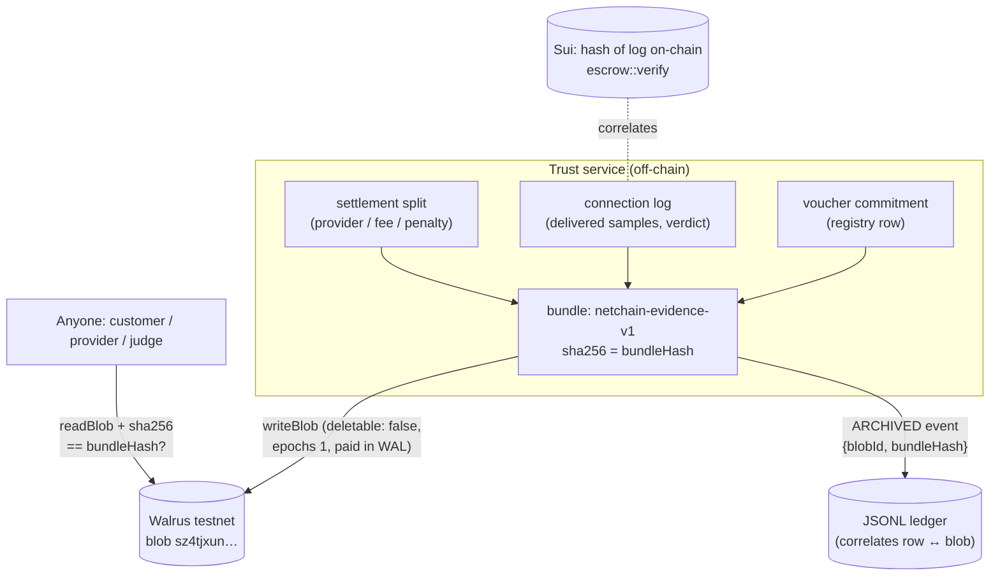

# Live AI↔Sui Integration + Walrus Evidence — Implementation Guide (Person 3)

**Session: 2026-08-31 · branch `herman` · status: PROVEN on testnet**
Companion docs: `person3-implementation-guide.md` (core walkthrough, unchanged),
`sui-tracks-status.md` (official track mapping + answers), `demo-pr-rehearsal.md`
(video/PR/rehearsal checklist).

This document explains WHAT was built today, WHY each piece exists (project
need first, track alignment as consequence), and HOW to operate it — with
diagrams. Everything below was executed on Sui testnet with real Circle USDC.

---

## 1. The one-paragraph summary

Until today, the AI↔Sui loop existed only as scripted fixtures: the Rescue
Agent's signed offer was a JSON file on disk. The live system now works
end-to-end — the Rescue Agent's gateway publishes a signed Selected Offer, the
trust service pulls it, verifies both ed25519 signatures, locks real USDC in
escrow **on-chain**, verifies delivered capacity, settles the split, and
pushes the result back to the Rescue Agent. After settlement, the complete
evidence bundle (voucher + connection log + split) is archived to Walrus so
anyone can retrieve it without trusting our server. One env var
(`SUI_INTEGRATION_MODE`) switches between the full autonomous system, a
single driven loop, and the old scripted mode — the deadline safety valve.

## 2. The integration contract (what changed, file by file)

| File | Change | Why (purpose) |
| --- | --- | --- |
| `src/sui/integration.js` | **NEW** — mode switch, auto-pipeline, poller, simulated session monitor | The live loop needs a driver that is one code path in all three modes (write once, degrade gracefully) |
| `scripts/integrate-sui.mjs` | **NEW** + `npm run integrate:sui` | The one-loop demo beat: submit intent → settle → narrate digests |
| `src/sui/server.js` | `POST /v1/verify` endpoint + full-mode poller start | A real session monitor (or P2) must be able to POST delivered samples; full mode must run autonomously |
| `src/a2a/schemas/selectedOffer.js` | optional `originalOffer` field | Live envelopes must be self-contained — the trust service cannot fixture-lookup offers that were created seconds ago |
| `src/agents/rescueAgent.js` | embeds `originalOffer` in the envelope | (P2 runtime, one line) — completes the self-containment above |
| `src/sui/voucher.js` | `resolveOriginalOffer`: opts → embedded → offersDir, with `OFFER_MISMATCH` guard (providerId+offerId must match the projection) | Zero fixture lookups for live offers; an embedded foreign offer is rejected even with a valid signature |
| `src/a2a/quoteAsset.js` | **NEW** — testnet → USD @ `SUI_TESTNET_PRICE_SCALE` (default ×0.025), localnet → profile currency | Providers must quote in the money the escrow settles (USDC on testnet) — the runtime twin of the fixture generator's two-track sizing |
| `src/agents/providerAgent.js`, `src/a2a/buildProviderRequest.js` | quote/request currency via `quoteAsset` | Same reason — the request tells providers which money to quote |
| `scripts/start-provider-agents.mjs` | loads `.env` | `SUI_NETWORK` must reach the quoting code (rescue agent already did this) |
| `src/sui/walrus.js` | **NEW** — evidence bundle, upload, readback, SUI→WAL swap | Public, tamper-evident evidence (see §5) |
| `scripts/sui-walrus.mjs` | **NEW** + `npm run walrus:proof` | Archive + independent readback proof in one command |
| `src/sui/events.js` | `eventsByIncident()` reader | The archive bundle is assembled from ledger rows |
| `src/sui/client.js` | export `signAndRun` | The Walrus SUI→WAL swap reuses the hardened execution path |

## 3. The live loop — sequence

The offline test (`test/sui-integration.test.js`) runs this EXACT flow minus
the chain: real provider agents + real Rescue Agent as in-process HTTP
servers, real signatures, stubbed `service.client`. 6 tests: pipeline,
idempotency, poller state, dead-gateway tolerance, mode validation,
deterministic monitor.

## 4. The three modes — your deadline safety valve

| Mode | Command | Uses | When |
| --- | --- | --- | --- |
| `standalone` | `npm run demo:sui` / `harness:sui` | fixtures only, no gateway | old reliable; venue Wi-Fi dies; P2 runtime broken |
| `one-loop` | `npm run integrate:sui` | live gateway, one incident | the demo headline with minimal moving parts |
| `full` | `SUI_INTEGRATION_MODE=full npm run trust:server` | live gateway, every incident, auto | the real MVP — leave running at a booth |

Same pipeline code in all three (`processEnvelope`); only the trigger differs.
Restart safety: processed incidents live in `events/integration-<net>.json`
AND the ledger/nonce registry blocks double-commits AND the chain no-ops
byte-identical replays — three independent layers (blueprint §6.1 defense in
depth).

Ops notes (traps learned the hard way today):
- The gateway caches results per incidentId; each demo run mints a unique
  incident (`INC-S2-Imthdxag1`-style suffix). `SUI_P2_INCIDENT_ID=<id>` pins
  one for controlled replay.
- Offers expire 60 s after quoting (`OFFER_TTL_MS`); a cached envelope goes
  stale — the unique-id default sidesteps it.
- The integration driver keeps its OWN ledger (`events/integration-<net>.jsonl`)
  so demo-era rows never block a fresh pool. Deleting the file is safe; the
  chain is the durable half.

## 5. Walrus evidence archive — why + how

**Why (the project need):** blueprint §4.3 promises "the customer can see
exactly what was delivered at any moment". Before today, the connection log
lived only in our own JSONL ledger — the chain held just its blake2b256 hash,
so a customer had to trust our server to keep serving the log. Walrus removes
the trust requirement: the bundle becomes a permanent, content-addressed blob
that anyone (customer, provider, judge) can fetch by ID.

- **OFF by default** (`WALRUS_ARCHIVE=true` enables) — zero cost/latency when off.
- **Best-effort**: a Walrus outage can never fail the settlement it follows (`ARCHIVE_SKIPPED`).
- **Fuel**: Walrus is paid in WAL; the buyer holds SUI. `scripts/sui-walrus.mjs`
  auto-swaps 0.2 SUI via the official testnet exchange
  (`exchange_all_for_wal`, tx `5RmcR1WWo3CsLHCYzzUzFMU1FpGHiDqgg2N7z4FxVVER`)
  once, then archives + READS BACK and asserts `sha256(read) == sha256(archived)`.
- **Proof of the day**: blob
  `sz4tjxunYifIVN327CFRlXTIdxVHtqKO1E2-0OHLJcM`
  (walruscan.com/testnet/blob/…) — voucher digest, verdict, penalty and the
  full delivered-samples array, publicly retrievable.

## 6. Proof index (everything on the record)

| Proof | Value |
| --- | --- |
| Integrated loop, incident `INC-S2-Imthcxrdw` | commit `6MJk8arxYHAtfWfwXiLEBCvfZB2swrPFa3aLsGVAar4p` · verify `228SdkMAhTeHJCLPREqx6dNB45gALH4kYMx2ibSFtszD` · settle `6Jswa4NvuSY3rcs4nFabGc8bM2eWR8CHxV2eNZiGAfFV` · P2 callback `SETTLED` confirmed on the gateway record |
| Integrated loop + archive, incident `INC-S2-Imthdxag1` | commit `J9cxtNWdhVez1DrV8E7MhtEnXPRfMFsNEYgstrjSECtU` · verify `FgBRERYwKVfrVJG5F3uDvMXknN6zhijNXNTC2fLDs8ro` · settle `GCKGwMvvrJPLB7zMBs131rvrpjCoZ1sMco9JCAEjAnoX` · blob `sz4tjxunYifIVN327CFRlXTIdxVHtqKO1E2-0OHLJcM` |
| SUI→WAL fuel swap | `5RmcR1WWo3CsLHCYzzUzFMU1FpGHiDqgg2N7z4FxVVER` |
| Reliability harness | 13/13 PASS on testnet (post-integration regression run) |
| Offline suite | 89/89 (83 prior + 6 new integration tests) |
| Move tests | 19/19 (unchanged contracts — no redeploy needed) |
| New escrow pool (readme updated) | `0x65b3503164b9de0b35ab0b7e49b0d13d5c8721a42570e814119f7143a1299125`, authority `0xedd9c5e475f6de6a855a4db0b7d6299c4bb317557e016276c3154505c618cbc9` |

## 7. Track scoring, honestly

- **Track 01 (Payments & Stablecoins)** — was already complete (escrow, gasless,
  sponsored, PTBs, split settlement). Today added nothing Track-01-specific;
  the rails are unchanged.
- **Track 02 (AI × SUI)** — today's work is entirely here: the AI application
  and the chain were two demos; now they are one live system (§3), the
  evidence is publicly verifiable (§5), and "Sui is integral" is demonstrable
  in one command. zkLogin (identity leg) is Person 1's frontend scope; the
  payment side needs nothing (boundary recorded in `sui-tracks-status.md` §3).

## 8. What I deliberately did NOT do

Per the no-track-candy rule: no per-voucher NFT receipts (extra gas, no user
need), no on-chain ZK, no live CAMARA (mock per blueprint §7.1), no mainnet
(rule: automatic DQ), no schema-breaking changes to P2's wire contract (the
`originalOffer` field is optional and buyer-signature-transparent).
